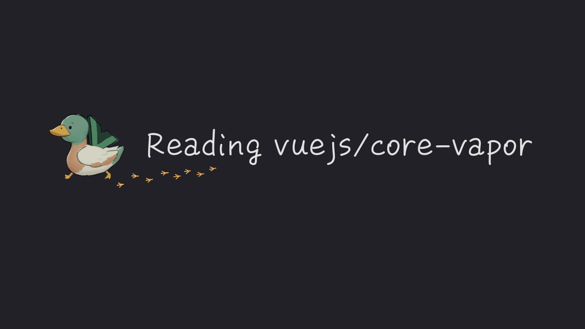
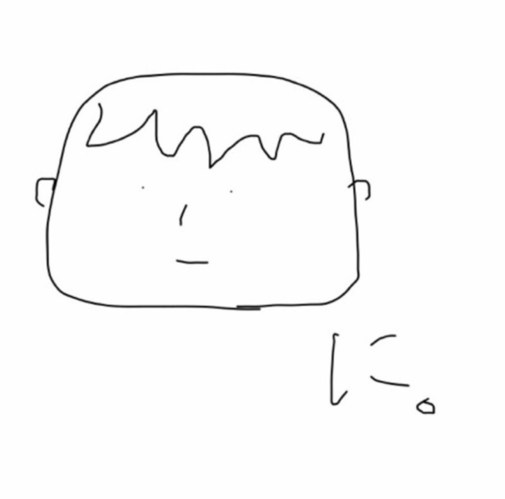

[Reading vuejs/core-vapor](https://ubugeeei.github.io/reading-vuejs-core-vapor/)

## Introduction

Thank you for picking up this book!\
This book is a guide to understanding the implementation of Vapor Mode, the next-generation implementation of Vue.js.\
While it’s aimed at more advanced readers, I hope you find something helpful, even if only in parts!

## Purpose of This Book

- **To gain a deep understanding of Vapor Mode, the next-generation implementation of Vue.js**
- To deepen your knowledge of what Vapor Mode is
- To understand how it's implemented by reading through the source code

#### What This Book Is Not About

- Learning how to use Vue.js
- Comparing and evaluating it against other frameworks

## Intended Audience

- Those interested in contributing to vuejs/core or vuejs/core-vapor
- Those who want to deepen their understanding of Vue.js

## About the Author

**ubugeeei**

Vue.js member and core staff of the Vue.js Japan User Group.\
Involved in the development of Vapor Mode from its inception (November 2023).\
Became an external collaborator for vuejs/core-vapor in October 2023.\
In April 2024, joined the Vue.js organization and became a member of the Vapor Team.

https://ublog.dev/

## Sponsors

If you'd like to support my work, I would greatly appreciate it!

https://github.com/sponsors/ubugeeei

